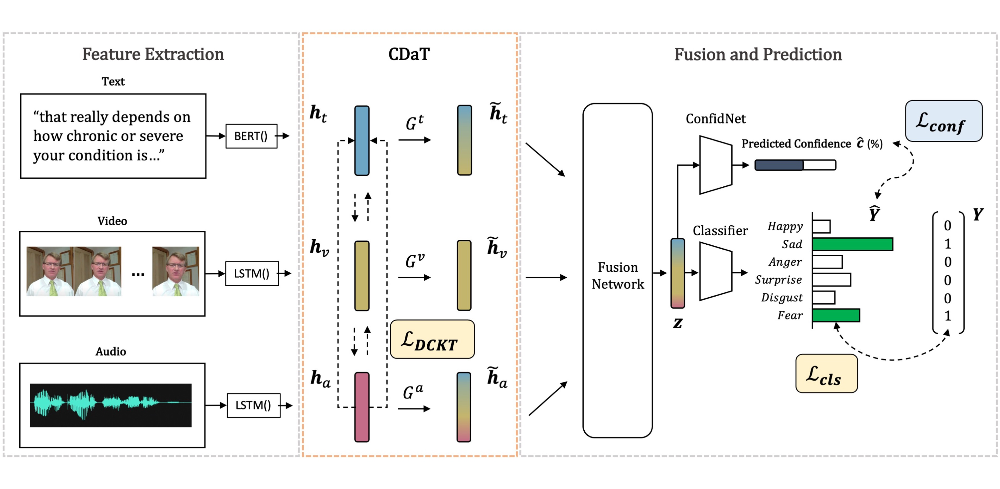

  

# CDaT
> Pytorch implementation for Cross-Modal Dynamic Transfer Learning for Multi-Modal Emotion Recognition


## Paper
**[Cross-Modal Dynamic Transfer Learning for Multi-Modal Emotion Recognition](https://ieeexplore.ieee.org/document/10409167)** (Accepted at IEEE Access)


## Overview

### Overall Architecture for CDaT
<p align="center">


We proposed a representation learning method called Cross-Modal Dynamic Transfer Learning (CDaT), which dynamically filters the low-confident modality and complements it with the high-confident modality using uni-modal masking and cross-modal representation transfer learning. We train an auxiliary network that learns model confidence scores to determine which modality is low-confident and how much the transfer should occur from other modalities. Furthermore, it can be used with any fusion model in a model-agnostic way because it leverages transfer between low-level uni-modal information via probabilistic knowledge transfer loss.


## Usage

### Datasets

* [CMU-MOSEI](https://github.com/kniter1/TAILOR)
* [IEMOCAP](https://sail.usc.edu/iemocap/)


### get started

1. the first step is clone this repo

```
git clone git@github.com:SoyeonHH/CDaT.git
```

2. Set up the environment (need conda prerequisities) from the `environment.yml` file

```
conda env create -f environment.yml
bash init.sh
```

3. Download the dataset and put it in the `data` folder & Modify the path in `train.py`

```python
mosei_data_dir = 'YOUR_PATH'
iemocap_data_dir = 'YOUR_PATH'
```

4. Train the model

```
bash train.sh
```

5. Test the model

```
bash inference.sh
```

Note that modify the model path and data path


### Acknowledgement
Some portion of the code were adapted from the [TAILOR](https://github.com/kniter1/TAILOR) repo.
We thank the authors for their great work.
